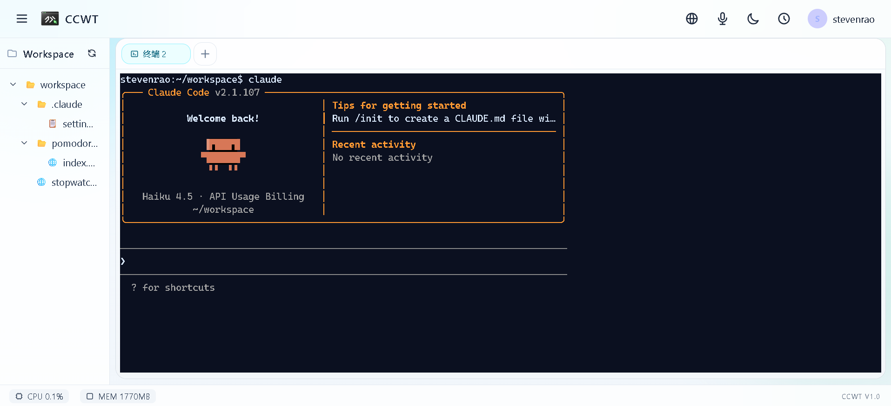
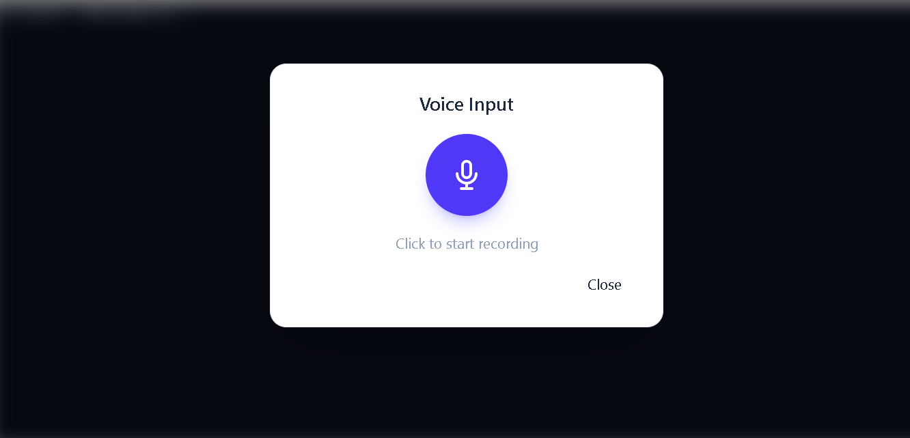

# CCWT - Claude Code Web Terminal

<p align="center">
  
</p>

> 专为 Claude Code CLI 设计的自托管多用户 Web 工作台 | 多用户隔离 · 项目隔离 · 全平台自适应

<p align="center">
  <a href="./README_EN.md">English</a> | 中文
</p>

<p align="center">
  <a href="https://github.com/ccwt/ccwt/releases">
    
  </a>
  <a href="https://github.com/ccwt/ccwt/blob/main/LICENSE">
    
  </a>
  
</p>

---

## 解决什么问题？

- **多用户共享服务器时**：所有用户的 Claude 配置、OAuth 凭据、会话历史混在一起，互相覆盖
- **多项目管理时**：不同项目的上下文相互干扰，切换项目后 AI "失忆"
- **移动办公时**：手机/平板上无法使用 Claude Code

**CCWT** 正是为了解决这些问题而生的——一个纯净、专注、多用户隔离、项目隔离的 Claude Code 云端工作台。

---

## 核心特性

### 🔐 多用户隔离 · 项目隔离

每个 CCWT 用户拥有完全独立的 Claude 配置空间，互不干扰：

```
~/.ccwt/users/
├── alice/
│   ├── .claude/      # Alice 自己的 OAuth 凭据、设置、历史
│   └── workspace/    # Alice 的项目文件夹
└── bob/
    ├── .claude/      # Bob 的独立配置，与 Alice 彻底隔离
    └── workspace/    # Bob 的项目文件夹
```

用户 A 完成 OAuth 认证后，用户 B 登录 CCWT 仍需自行认证，无法复用 A 的 Token。

### 🖥️ 100% 还原原生终端体验

- 支持所有 `/slash` 命令
- 支持 MCP 协议
- 支持交互式输入
- 终端历史回滚（5MB 缓冲区）
- 页面刷新后可恢复会话

### 📁 项目级上下文隔离

同一用户的不同项目分别存放在独立文件夹中，Claude Code 的上下文、会话记录按项目自动隔离。切换项目时环境变量、工作目录自动同步。

### 🔧 内置 SOCKS5 代理

解决远程服务器首次登录 Claude 时的 IP 漂移问题。管理员可一键开启 SOCKS5 代理，用户配置本地代理后即可完成 OAuth 认证。

### 🎤 离线语音输入

采用 `whisper.cpp` 实现离线语音识别，用户音频数据仅在内存中处理，不上传第三方，保护隐私。

<p align="center">
  
</p>

### 📱 全平台自适应

- **桌面端**：左侧文件树 + 右侧终端，清晰的视图划分
- **移动端**：汉堡菜单滑出侧边栏，终端全屏显示
- 虚拟功能键栏（Ctrl, Tab, Esc、↑、↓ 等）

---

## 快速开始

### 一键部署

CCWT 被打包成**单一二进制文件**，零依赖：

```bash
# 下载对应平台的二进制
curl -L https://github.com/ccwt/ccwt/releases/latest/download/ccwt-linux-amd64 -o ccwt
chmod +x ccwt

# 直接启动（默认端口 3000）
./ccwt
```

### 开启注册（可选）

```bash
# 使用邀请码启动
./ccwt -code=your-secret-code

# 关闭注册（默认）
./ccwt
```

### 首次使用

1. 访问 `http://your-server-ip:3000`
2. 注册第一个用户（自动成为管理员）
3. 进入设置 → 开启 SOCKS5 代理
4. 本地浏览器配置 SOCKS5 代理 `your-server-ip:1080`
5. 终端输入 `claude` 完成 OAuth 认证
6. 关闭代理，开始使用

---

## 技术栈

| 层级 | 技术选型 |
|------|---------|
| 后端 | Go + Gin |
| 前端 | Vue 3 + Vite |
| 终端 | xterm.js + go-pty |
| 数据库 | SQLite |
| 认证 | JWT |
| 隔离 | Bubblewrap (bwrap) |

---

## 未来规划

- [ ] 团队协作与项目分享
- [ ] MCP 服务器图形化管理
- [ ] 更多终端主题

---

## 欢迎贡献

Issues 和 Pull Requests 都是受欢迎的！

如果你对 CCWT 感兴趣，欢迎 Star 支持一下。

**GitHub**: https://github.com/ccwt/ccwt

---

*CCWT - 让开发者无论身处何地，用任何设备，都能以最纯净、最隔离的方式使用 Claude Code。*
